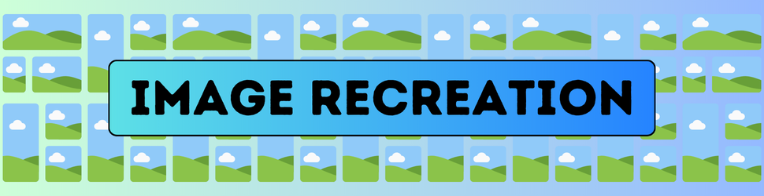

Welcome to the **Image Recreation Using Genetic Algorithm** project! This application demonstrates the power of genetic algorithms by evolving binary images to closely resemble a target image. Featuring a Django-powered web interface with real-time updates via **Django Channels**, users can interact with the algorithm in a seamless and dynamic environment. It also highlights optimization techniques inspired by natural evolution.

---

## 🖋 Table of Contents
1. [Overview](#-overview)
2. [Features](#-features)
3. [Screenshots](#-screenshots)
4. [Installation](#-installation)
5. [Usage](#-usage)
6. [Dependencies](#-dependencies)
7. [Technical Details](#-technical-details)
8. [Contributors](#-contributors)

---

## 📜 Overview

This project leverages **Genetic Algorithms (GA)** to reconstruct a predefined target image from a random population of binary (black-and-white) images. By employing techniques like selection, crossover, and mutation, the algorithm iteratively evolves toward a solution.  

With the Django web interface, users can upload target images and monitor real-time updates of the evolution process via **WebSockets**, powered by **Django Channels**.  

### Key Highlights:
- **Real-Time Updates**: View generation progress instantly via WebSockets.
- **Fitness Evaluation**: Matches the generated image to the target based on pixel similarity.
- **Tournament Selection**: Selects parents for producing the next generation.
- **Uniform Crossover**: Combines traits from two parents to create offspring.
- **Mutation**: Introduces randomness to maintain diversity.
- **Replacement Strategy**: Ensures progressive evolution through generations.
  
---

## ✨ Features

- **Interactive Web Interface**:
  - Upload target images or select any of the existing images.
  - View real-time evolution updates and the final results.

- **Genetic Algorithm Implementation**:
  - Chromosome Representation: Binary images as 2D arrays of 0s and 1s.
  - Fitness Function: Measures the similarity to the target image.
  - Iterative Population Evolution: Progressively improves over generations.

- **Real-Time Functionality**:
  - Built with Django Channels for WebSocket-based updates.
  - Watch the evolution process live without refreshing the page.
    
---

## 🗄 Screenshots

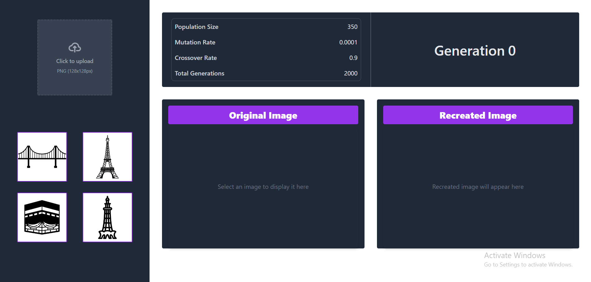

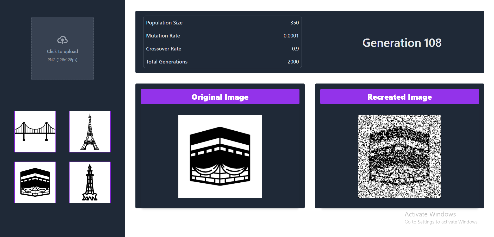

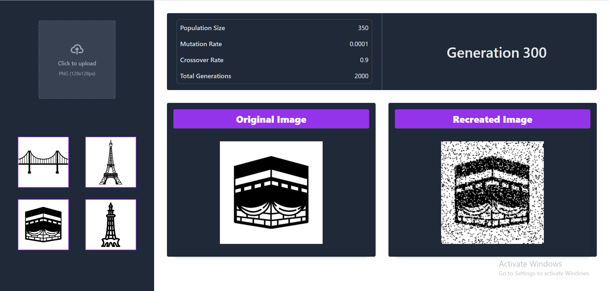


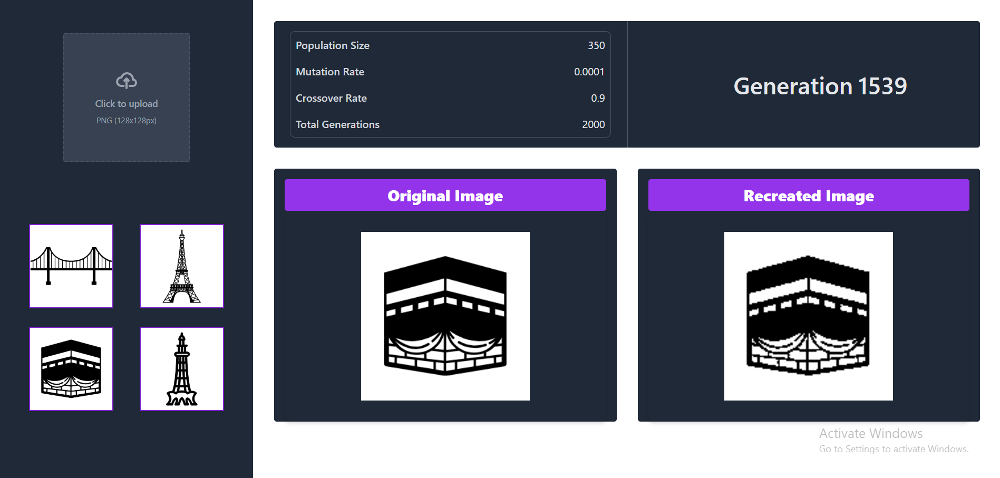

---

## 🚀 Installation

1. Clone the repository:
   ```bash
   git clone https://github.com/USMAN-FAIZYAB-KHAN/Image-Recreation.git
   cd Image-Recreation
   ```

2. Create and activate a virtual environment (optional but recommended):
   ```bash
   python -m venv venv
   source venv/bin/activate  # On Windows: venv\Scripts\activate
   ```

3. Install Dependencies:
   ```bash
   pip install -r requirements.txt
   ```

4. Run the development server:
   ```bash
   python manage.py runserver
   ```

5. Visit `http://127.0.0.1:8000/` to explore the application.

---

## 📖 Usage

1. Upload or select an image from the web interface.  
2. The genetic algorithm starts automatically after the image is selected or uploaded.  
3. View live updates of the recreation process on the web interface.  
4. The final recreated image is displayed upon completion.  

---

## 📦 Dependencies

The following Python libraries are required:

- **Django**: Framework for the web interface.
- **Django Channels**: Real-time WebSocket support for live updates.
- **NumPy**: Efficient array computations.
- **Pillow**: Image handling and processing.

Install all dependencies with:
```bash
pip install -r requirements.txt
```

---

### 🧑‍💻 Technical Details  

This project utilizes a genetic algorithm to evolve a population of binary images, gradually improving them to match a target image. The process involves several key steps:  

1. **Initialization**: A population of random binary images is created, with each pixel representing a gene (0 or 1). These images serve as the starting point for the algorithm.  
   <div align="center">
     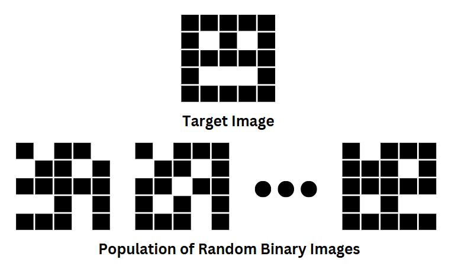
   </div>  

2. **Fitness Evaluation**: The fitness of each image is evaluated by comparing it to the target image. The algorithm counts the number of pixels in the population that match the corresponding pixels in the target, and this number is used as the fitness score.  
   <div align="center">
     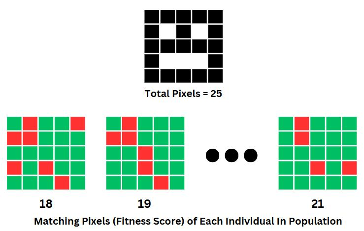
   </div>  

3. **Selection**: Tournament selection is applied to choose parent images based on their fitness. A subset of individuals is selected at random, and the one with the highest fitness in this subset is chosen to act as a parent.  
   <div align="center">
     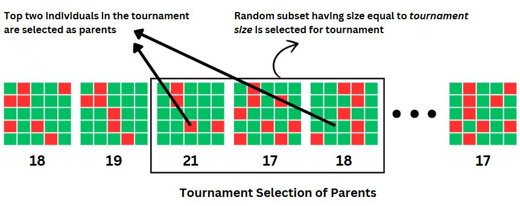
   </div>  

4. **Crossover**: Parents are combined using uniform crossover, where traits (pixels) from each parent are mixed according to a random mask. This introduces genetic variation by blending features from the parent images.  
   <div align="center">
     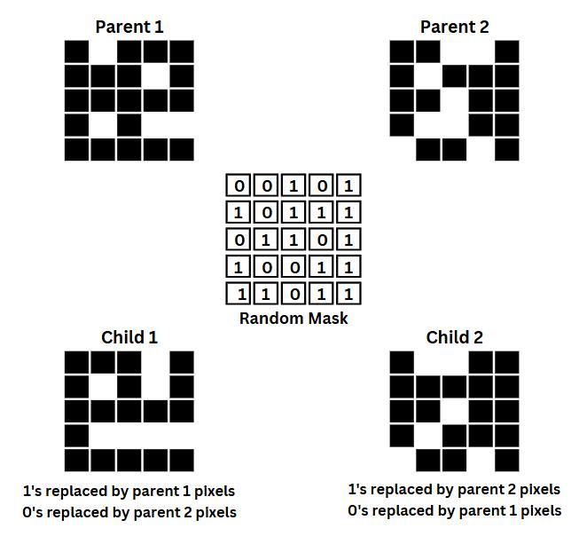
   </div>  

5. **Mutation**: To further promote diversity, a small percentage of pixels in the offspring are flipped. This mutation introduces random changes to the images, helping to avoid premature convergence.  
   <div align="center">
     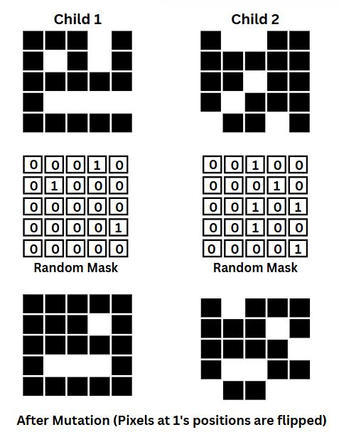
   </div>  

6. **Replacement**: The old population is replaced by the new generation of offspring. This allows the algorithm to progress toward the target image over multiple iterations.  
   <div align="center">
     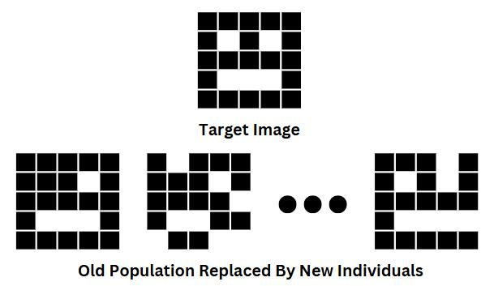
   </div>  

7. **Convergence**: These steps are repeated for several generations, with the population gradually evolving to closely match the target image. The process continues until a satisfactory solution is found.

---

## 🤝 Contributors
- [**Usman Faizyab Khan**](https://github.com/USMAN-FAIZYAB-KHAN)  
- [**Muhammad Zunain**](https://github.com/Muhammad-Zunain)  
- **Syed Abdul Basit**

---

Enjoy using this project! Contributions and feedback are welcome. 😊
